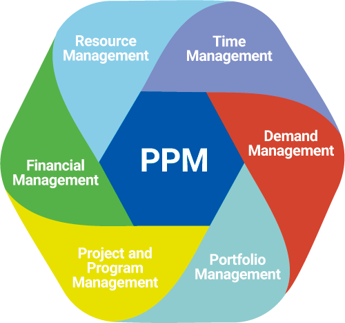

# Technology and Business Innovation Branch
## Project Portfolio Management Dashboard

**Built with R Shiny.**

 
 

  

 
 

TBI Project Portfolio Management Dashboard (TBI PPMD) displays information on schedule, milestones, budget, stage and project health for all IP and SF projects at Technology and Business Innovation Branch (TBI). 

The application consists of:

- ui.R: User interface of the application.

- server.R: Server components of the application.

- global.R: Libraries and data needed for the application.

- functions.R: Extra functions.

TBI PPMD
