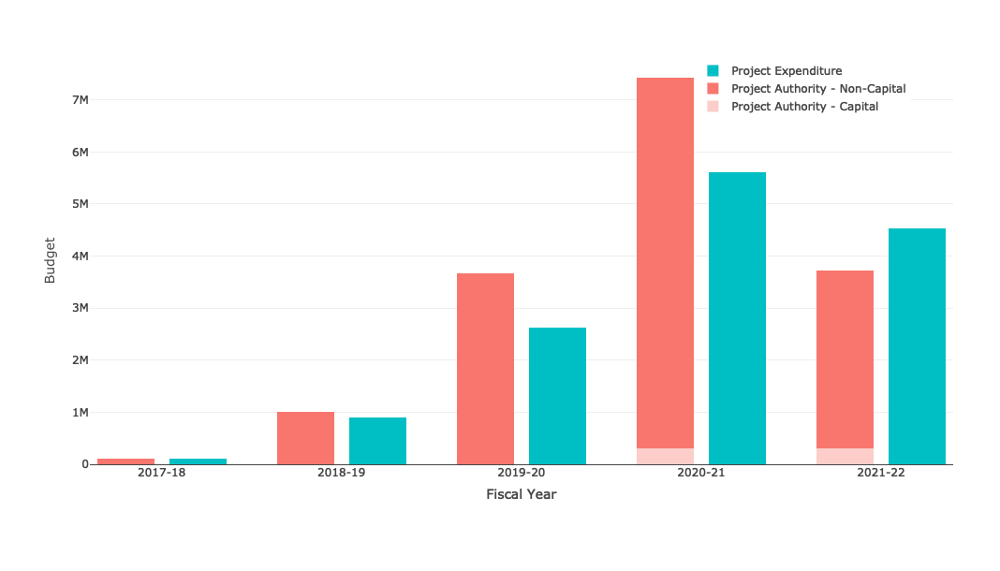

```{R Setup, include = FALSE, message = FALSE, warning = FALSE}

library(knitr)
library(kableExtra)
library(ggplot2)
library(emojifont)

knitr::opts_chunk$set(echo    = FALSE,
                      message = FALSE,
                      warning = FALSE)

options(knitr.table.format = "latex")
options(shiny.testmode = TRUE)

```

# Report for All Projects

## Up to date as of: `r Sys.Date()`.

```{R Titles}

title_628 <- "628: Establishment Licensing and Inspections"
title_A03 <- "A03: Enabling Compliance and Enforcement Program Delivery"
title_A04 <- "A04: ROEB Aging IT (Stabilization/Modernization/Transformation)"

title_A05<-'A05: Drug and Health Product Inspections Database'
title_A06<-'A06: Modernizing the ROEB Employee eToolkit'
title_701<-'701: Border IM/IT Modernization'

title_704<-'704: Quality Management System'
title_705<-'705: DAS Modernization'
title_cyclops<-'Cyclops'

title_hummingbird<-'Hummingbird'
title_cipher<-'Cipher'
title_kelpie<-'Kelpie'

title_ip000<-'IP000: PCP IT Modernization'

## All Project Codes and Project Names

#' - `r title_628`
#' - `r title_A03`
#' - `r title_A04`
#' - `r title_A05`
#' - `r title_A06`
#' - `r title_701`
#' - `r title_704`
#' - `r title_705`
#' - `r title_cyclops`
#' - `r title_hummingbird`
#' - `r title_kelpie`
#' - `r title_ip000`

```

## Overall Project Health Metadata

Project Health is evaluated by three components:

- Deliverability of functional elements
- Budget status
- Schedule

Out of 13 TBI projects with overall status information:

```{R SatusInformation}

num_delayed <- length(which(status$status == "Delayed"))
num_caution <- length(which(status$status == "Caution"))
num_ontrack <- length(which(status$status == "On-Track"))

```

- `r num_delayed` Delayed
- `r num_caution` Caution
- `r num_ontrack` On Track

Out of 13 TBI projects with overall health information:

```{r}

num_red    <- length(which(status$`Overall Project Health` == 'Red'))
num_yellow <- length(which(status$`Overall Project Health` == 'Yellow'))
num_green  <- length(which(status$`Overall Project Health` == 'Green'))

```
- `r num_red` Red
- `r num_yellow` Yellow
- `r num_green` Green

\newpage

# Project Budget Status

_These bubble plots visualize project budget health._

_The size of each circular area is relative to the size of the approved budget. The colors of these circles reflect project statuses where **Delayed** is red, **Caution** is yellow and **On-Track** is green._

## IP Projects

```{R IP_Projects, message = FALSE, warning = FALSE, fig.width = 10}

    status$IP2 <- paste0(status$IP)
    
    df <- status %>%
      filter(grepl("\\d", IP)) %>%
      filter(`Overall Project Health` != 'Blue') %>%
      filter(IP %in% ip_selected()$ips) %>%
      left_join(budget[,c('IP','Approved Budget')])
    
    df$status<-factor(df$status,levels=c('On-Track','Caution','Delayed'))
    
    status_plot(df, "IP Projects")
    
```

## Innovation Projects

```{R Innovation_Projects, message = FALSE, warning = FALSE, fig.width = 10}
    
    status$IP2<-paste0(status$IP)
    
    df <- status %>%
      filter(!grepl("\\d", IP)) %>%
      filter(`Overall Project Health`!='Blue')%>%
      filter(IP %in% ip_selected()$ips)%>%
      left_join(budget[,c('IP','Approved Budget')])
    
    df$status <- factor(df$status,levels=c('On-Track','Caution','Delayed'))
    
  status_plot(df, "Innovation Projects")
   
```

### Color code rules:

- Red: Significant course correction may be required. One or more of the intended project outputs may not be achieved. Identified changes may negatively impact the project's scope, cost or schedule and significant course correction may be required.
- Yellow: Some course correction may be required. One or more of the intended project outputs may not be achieved. Identified changes may negatively impact the project's scope, cost or schedule and some course correction may be required.
- Greem: The project is on track. The intended projet outputs are expected to be achieved. Identified changes are not expected to negatively impact the project's scope, cost or schedule.

\newpage

# Project Stages & Project Status

```{r,fig.width=10}

  df<-all_proj%>%
        filter(IP %in% ip_selected()$ips)%>%
        group_by(stage,status)%>%
        summarise(IP=paste(IP,collapse='\n'),count=n())
      df$status<-factor(df$status,levels=c('On-Track','Caution','Delayed','Not yet started'))
      
  stage_plot(df)
```

\newpage

# Budget Breakdown by Year

```{r, results='hide'}

  ds<-budget_yr%>%
      filter(IP %in% ip_selected()$ips)%>%
      #left_join(all_proj%>%select(IP=IP,internal_external=`Internal or External`))%>%
      group_by(Year,year,`Authority vs. Expenditures`)%>%
      summarise(Capital=sum(Capital,na.rm=T),
                Non_Capital=sum(Non_Capital,na.rm=T))
    
  #budget_plot(ds)
  
  p<-budget_plot(ds)%>%layout(height=500)
    
  # solution for plotly graphs not rendering in Rmarkdown PDF
  # tmpfile<-tempfile(fileext='.png')
  # export(p, file = "overall.png")
  # this doesn't work in shinyapps, but works in rstudio instance
```

```{r echo=FALSE,fig.align='center'}
# 
```


\newpage

# Budget Projections

This horizontal bar chart shows all project forecasted expenditures for the ongoing fiscal year, forecasted total expenditures, expenditures to date and approved budget.

```{R, fig.width = 10, fig.height = 4}

  ds<-budget%>%
        filter(IP %in% ip_selected()$ips)%>%
        left_join(all_proj%>%select(IP=IP))%>%
        summarise(`Approved Budget`=sum(`Approved Budget`,na.rm=T),
                  `Expenditure to Date`=sum(`Expenditure to Date`,na.rm=T),
                  `Remaining Budget Projected`=sum(`Variance / Remaining budget`,na.rm=T))%>%
        gather(cat,value)
      
      budget_plot2(ds)
      
```

\newpage

# Schedule

This timeplot shows all project tasks planned for the ongoing fiscal year, forecasted completion status and fiscal quarter. Completed tasks prior to the current fiscal year is hidden for simplicity. Only all tasks with complete milestone, approved finish date, actual finish date, and schedule health information will appear on the timeplot. If fewer datapoints are visualized than expected, the spreadsheet contains missing information.

```{r}

total_tasks      <- nrow(schedule)
total_completed  <- length(which(schedule$Schedule.Health.Standard == 'completed'))
total_incomplete <- length(which(schedule$Schedule.Health.Standard != 'completed'))

```

- All TBI tasks planned: `r total_tasks`
- Completed tasks: `r total_completed`
- Incomplete tasks: `r total_incomplete`

```{r,message=FALSE,warning=FALSE,results='hide',fig.width=12}

  df <- schedule %>%
    filter(!is.na(Approved_finish_date)) %>%
    filter(if(Schedule.Health.Standard == "completed"){Actual_date >= as.IDate(paste0(as.character(year(now())), "-01-01"))})
      # using schedule ommitted completed tasks because too crowded
      # only show tasks completed this year
  
      # shiny::validate((
      #   need(any(!is.na(df$Approved_finish_date)),'There is no information on project schedule')
      # ))
  
      incProgress(0.5)
  
      timeplot(df)

```  

\newpage

### Overall Budget Breakdown by Year Data Table

```{r}

  ds<-budget_yr%>%
        filter(IP %in% ip_selected()$ips)%>%
        group_by(Year,year,`Authority vs. Expenditures`)%>%
        summarise(capital=sum(Capital,na.rm=T),
                  non_capital=sum(Non_Capital,na.rm=T),
                  value=sum(Value,na.rm=T))%>%
        mutate_at(c('capital','non_capital','value'),dollar)
    
  knitr::kable(ds)

```

\newpage

### List of All Project Descriptions
```{r}
title_628<-'628: Establishment Licensing and Inspections'
title_A03<-'A03: Enabling Compliance and Enforcement Program Delivery'
title_A04<-'A04: ROEB Aging IT (Stabilization/Modernization/Transformation)'

title_A05<-'A05: Drug and Health Product Inspections Database'
title_A06<-'A06: Modernizing the ROEB Employee eToolkit'
title_701<-'701: Border IM/IT Modernization'

title_704<-'704: Quality Management System'
title_705<-'705: DAS Modernization'
title_cyclops<-'Cyclops'

title_hummingbird<-'Hummingbird'
title_cipher<-'Cipher'
title_kelpie<-'Kelpie'

title_ip000<-'IP000: PCP IT Modernization'
```

```{r}
project_628<-description$`Description`[description$IP=='628']
project_A03<-description$`Description`[description$IP=='A03']
project_A04<-description$`Description`[description$IP=='A04']

project_A05<-description$`Description`[description$IP=='A05']
project_A06<-description$`Description`[description$IP=='A06']
project_701<-description$`Description`[description$IP=='701']

project_704<-description$`Description`[description$IP=='704']
project_705<-description$`Description`[description$IP=='705']
project_cyclops<-description$`Description`[description$IP=='Cyclops']

project_hummingbird<-description$`Description`[description$IP=='Hummingbird']
project_cipher<-description$`Description`[description$IP=='Cipher']
project_kelpie<-description$`Description`[description$IP=='Kelpie']

project_ip000<-description$`Description`[description$IP=='IP000']
```

#### `r title_628` Descriptions
`r project_628`

#### `r title_A03` Descriptions
`r project_A03`

#### `r title_A04` Descriptions
`r project_A04`


#### `r title_A05` Descriptions
`r project_A05`

#### `r title_A06` Descriptions
`r project_A06`

#### `r title_701` Descriptions
`r project_701`


#### `r title_704` Descriptions
`r project_704`

#### `r title_705` Descriptions
`r project_705`

#### `r title_cyclops` Descriptions
`r project_cyclops`


#### `r title_hummingbird` Descriptions
`r project_hummingbird`

#### `r title_cipher` Descriptions
`r project_cipher`

#### `r title_kelpie` Descriptions
`r project_kelpie`


#### `r title_ip000` Descriptions
`r project_ip000`